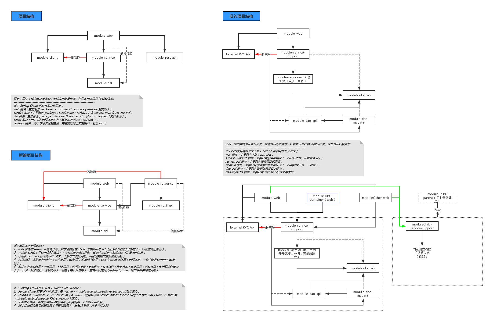

## 自定义Maven脚手架，快速构建项目
#### 模块说明
* 三个模块
> - 相同点：都使用 maven 构建项目
> - 不同点：注意构建单模块和多模块的 web 应用时，由于 web 模块相对位置的不同，logback、*_config.properties等文件的相对位置的差异

* maven-archetype-simple
> - 构建标准 Java 应用(简单单体应用)；
> - 可在运行命令中指定不同环境的参数，如：java -jar ROOT.jar --server.port=8088。

* maven-archetype-webapp
> - 构建普通 Java Web 应用（MVC），使用 Spring Boot 做 Web 框架；
> - 支持根据 Maven & Spring Profiles 适配不同的环境参数。

* maven-archetype-webapp-with-multi-modules
> - 构建模块化的 Java Web 应用（MVC & 模块化），使用 Spring Boot 做 Web 框架，可选用 Spring Cloud 做 RPC 框架；
> - 支持根据 Maven & Spring Profiles 适配不同的环境参数。

#### 使用方法
1. git clone 当前工程；
2. 执行 sh build.sh 或 build.cmd ；
3. 使用以下命令创建项目（注意 -DarchetypeArtifactId 的值加后缀 -archetype ，否者类型不匹配；可选值：maven-archetype-simple-archetype、maven-archetype-webapp-archetype、maven-archetype-webapp-with-multi-modules-archetype）： 
    > 1. cd YOUR_WORKSPACE
    > 2. mvn archetype:generate -DarchetypeGroupId=com.caiya -DarchetypeArtifactId=maven-archetype-simple-archetype -DarchetypeVersion=1.0.0-SNAPSHOT -DgroupId=YOUR_PROJECT_GROUP_ID -DartifactId=YOUR_PROJECT_ARTIFACT_ID -Dversion=1.0.0-SNAPSHOT -DarchetypeCatalog=local -X

#### 参考
> * https://maven.apache.org/archetype/maven-archetype-plugin/examples/create-multi-module-project.html
> * https://docs.spring.io/spring-boot/docs/2.0.4.RELEASE/reference/htmlsingle/#boot-features-external-config-profile-specific-properties
* 工程的模块化（用 Spring Cloud 作为 RPC 框架时）

